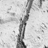
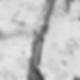
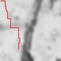

# PULSAR Software Department Task
## Setup
Create a virtual environment with following code:
```bash
python3 -m venv pulsar_env
```

Activate the virtual environmnet on Linux:

```
./pulsar_env/bin/activate
```

or on Windows:

```
.\pulsar_env\Scripts\activate.bat
```

Download the necessary libraries using following command:
```
pip install -r requirements.txt
```
## Usage
```
main.py [-h] --path PATH [--blur BLUR] [--src SRC SRC] --dest DEST DEST
               [--diagonal]
```
Calculate the shortest path to the destination coordinates for a rover.

Options:
 - -h, --help        Show this help message and exit
 - --path PATH       Path to the map image
 - --blur BLUR       Sets how smoothed the image provided will be
 - --src SRC SRC     Source point coordinates as 'x y' (x = horizontal, y = vertical, default = '1 1')
 - --dest DEST DEST  Destination point coordinates as 'x y' (x = horizontal, y = vertical, default = '1 1')
 - --diagonal        Allows diagonal movements

Example:
```
python3 main.py --path terrain.jpg --blur 2 --dest 30 80
```

These settings will use `terrain.jpg` file, blur it using Gaussian blur with radius of 2, the destination coordinates are *(30,80)*, diagonal moves are disabled.

## Image

The following image is being used for solving the exercise:


It is converted to the following format (resize + extract red channel):



Then it is blurred:



Here is the path over the image demonstrating the result of the algorithm:



The result is reproduced with the command presented as an example in the [previous section](#Usage).
